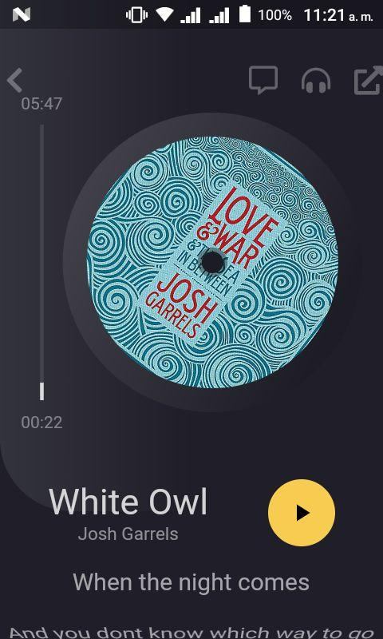

# Flutter Music Player

<!--   -->

## Flutter Music Player App
Una simple aplicación de reproducción de música creada con el kit de herramientas flutter donde aplico dos elementos básicos, el **desarrollo frontend** del app a partir de un **UI/UX** personalizado y el **patrón de diseño Provider** para la lógica del funcionamiento.

## Te gustaría aprender Flutter, visita el apartado de **Getting Started**

A few resources to get you started if this is your first Flutter project:

- [Lab: Write your first Flutter app](https://flutter.dev/docs/get-started/codelab)
- [Cookbook: Useful Flutter samples](https://flutter.dev/docs/cookbook)

For help getting started with Flutter, view our
[online documentation](https://flutter.dev/docs), which offers tutorials,
samples, guidance on mobile development, and a full API reference.
